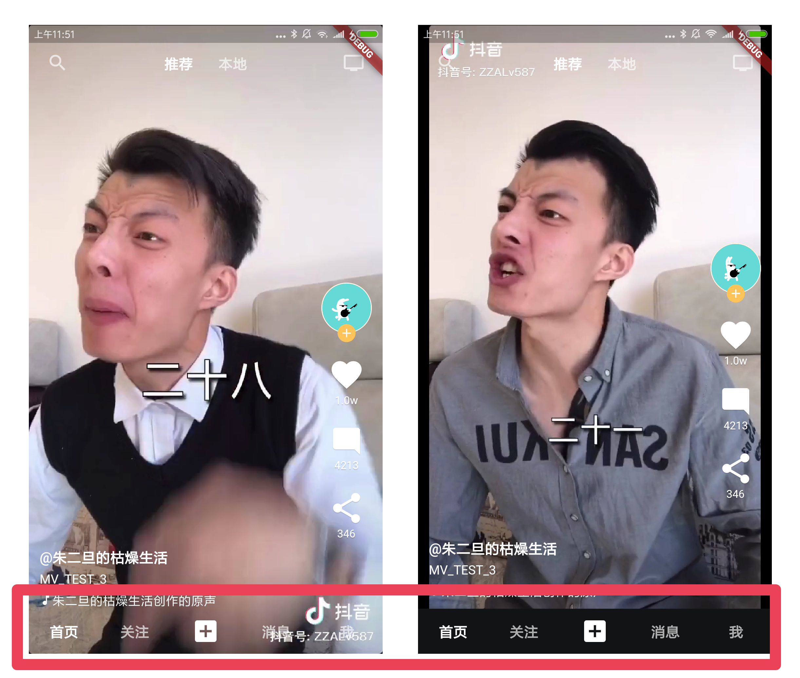

# flutter_tiktok

仿写抖音的flutter app。主要实现了看视频功能  

支持空安全，支持flutter web

# 实现功能

- 上下刷视频，视频会自动加载封面
- 左右滑动去搜索与个人中心
- 双击冒爱心点赞
- 看评论
- 切换底部Tabbar


# 应用截图


# 细节

适配了不同比例屏幕，在细长的屏幕上，底部tabbar不会叠加在视频上：




图示为debug下强行调整的效果，App会根据手机当前的屏幕比例来自动判断


# 其他

其他页面不属于视频业务的，就简单仿写了样式。需要自定义项目的话，简单替换成自己写的各种页面即可。  

需要无限增加视频的，只需要在PageView滑动到最后的时候给数组添加视频就行，很简单。  

加载一定量视频后记得释放掉不用的播放器，避免内存用太多而闪退。

# 项目结构


依赖：
```yaml
  # 加载动画库(好像改版之后就没用到了)
  flutter_spinkit: ^4.1.2
  # Bilibili开源的视频播放组件
  fijkplayer: ^0.8.3
  # 基础的透明动画点击效果
  tapped: any
  # map安全取值
  safemap: any
```
主要文件：
```bash
./lib
├── main.dart
├── mock
│   └── video.dart # 假数据
├── other
│   └── bottomSheet.dart # 修改了系统BottomSheet的高度
├── pages
│   ├── cameraPage.dart # 拍摄页（没有实际功能）
│   ├── followPage.dart  # 略
│   ├── homePage.dart # 主页面，包含tikTokScaffold的实际应用功能
│   ├── msgDetailListPage.dart # 略
│   ├── msgPage.dart # 略
│   ├── searchPage.dart # 略
│   ├── todoPage.dart # 略
│   ├── userDetailPage.dart # 略
│   ├── userPage.dart # 略
│   └── walletPage.d # 略
├── style
│   ├── style.dart # 全局文字大小与颜色
│   └── text.dart # 主要的几个文字样式
└── views
    ├── backButton.dart # iOS形状的返回按钮组件
    ├── loadingButton.dart # 可以设置为载入样式的按钮组件
    ├── selectText.dart # 可设置为“选中”或者“未选中”样式的文字
    ├── tikTokCommentBottomSheet.dart # 仿Tiktok评论样式
    ├── tikTokHeader.dart # 仿Tiktok顶部切换组件
    ├── tikTokScaffold.dart # 仿Tiktok核心脚手架，封装了手势与切换等功能，本身不包含UI内容
    ├── tikTokVideo.dart # 仿Tiktok的视频UI样式封装，不包含视频播放
    ├── tikTokVideoButtonColumn.dart # 仿Tiktok视频右侧的头像与点赞等按钮列的组件
    ├── tikTokVideoGesture.dart # 仿Tiktok的双击点赞效果
    ├── tikTokVideoPlayer.dart # 视频播放页面，带有控制滑动的VideoListController类
    ├── tiktokTabBar.dart # 仿Tiktok的底部Tabbar组件
    ├── tilTokAppBar.dart # 仿Tiktok的Appbar组件
    ├── topToolRow.dart # 用户页面的顶部状态，在tab切换到user页面时隐藏返回按钮
    └── userMsgRow.dart # 一条用户信息的样式组件
```

# 致谢

左右滑动手势代码来自项目 https://github.com/ditclear/tiktok_gestures 作者的封装，在此致谢。

# 请我喝咖啡

我相信本项目的代码一定能在商业项目上帮助到您，如果您从本项目中获益，不妨请作者我喝杯咖啡：

